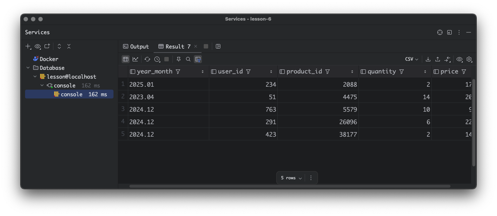

# Урок 6 Функции для работы с типами данных, агрегатные функции и UDF

Данное домашнее задание выполнено в ClickHouse v24.12.3 установленного в docker container.
Все данные с которыми я работал во время выполнения ДЗ прокинуты в корень текущего репозитория и загружены в git
Если потребуется более детальная проверка ДЗ, контейнер запустится с базами которыми я работал. 

Как запустить контейнера ClickHouse?

``` 
docker compose up --build -d
```

Как попасть в контейнер с ClickHouse?

``` 
docker compose exec clickhouse-server bash
```
Как авторизоваться в ClickHouse?

```
clickhouse-client --user default --password 12345
```

Этапы выполнения ДЗ

### Агрегатные функции

#### Рассчитайте общий доход от всех операций.


#### Найдите средний доход с одной сделки.


#### Определите общее количество проданной продукции.


#### Подсчитайте количество уникальных пользователей, совершивших покупку.


### Функции для работы с типами данных

#### Преобразуйте `transaction_date` в строку формата `YYYY-MM-DD`.


#### Извлеките год и месяц из `transaction_date`.


#### Округлите `price` до ближайшего целого числа.


#### Преобразуйте `transaction_id` в строку.


#### Извлеките год и месяц из `transaction_date`.
Для разнообразия перейдем в DataGrid

```
SELECT
    formatDateTime(transaction_date, '%Y.%m') AS year_month,
    user_id,
    product_id,
    quantity,
    price
FROM
    transactions
limit 5;
```

