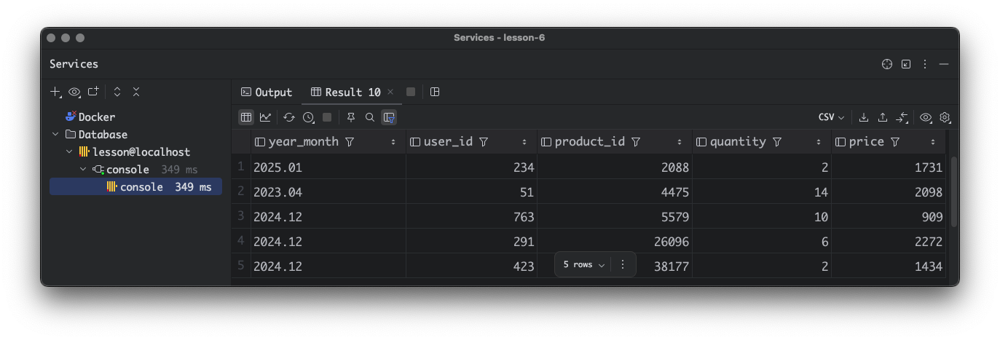
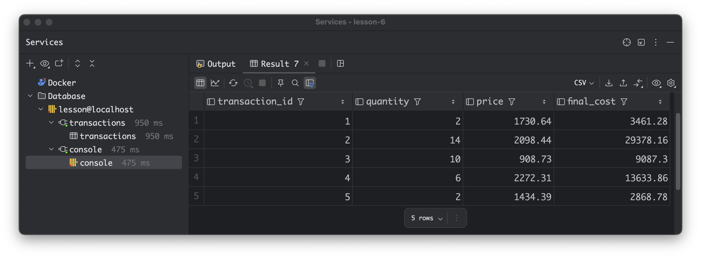
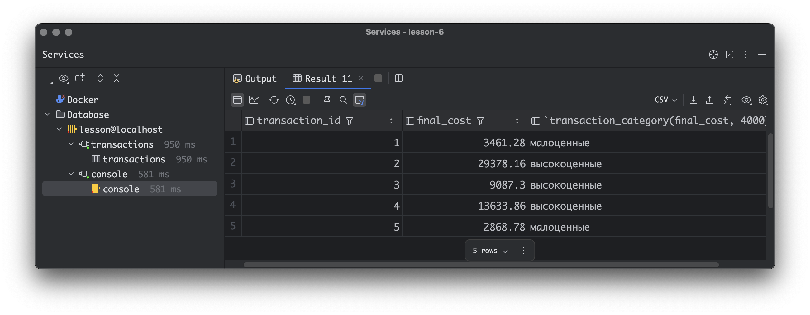

# Урок 6 Функции для работы с типами данных, агрегатные функции и UDF

Данное домашнее задание выполнено в ClickHouse v24.12.3 установленного в docker container.

Как запустить контейнера ClickHouse?

``` 
docker compose up --build -d
```

Как попасть в контейнер с ClickHouse?

``` 
docker compose exec clickhouse-server bash
```
Как авторизоваться в ClickHouse?

```
clickhouse-client --user default --password 12345
```

Этапы выполнения ДЗ

### Агрегатные функции

#### Рассчитайте общий доход от всех операций.


#### Найдите средний доход с одной сделки.


#### Определите общее количество проданной продукции.


#### Подсчитайте количество уникальных пользователей, совершивших покупку.


### Функции для работы с типами данных

#### Преобразуйте `transaction_date` в строку формата `YYYY-MM-DD`.


#### Извлеките год и месяц из `transaction_date`.


#### Округлите `price` до ближайшего целого числа.


#### Преобразуйте `transaction_id` в строку.


#### Извлеките год и месяц из `transaction_date`.
Для разнообразия перейдем в DataGrid

```
SELECT
    formatDateTime(transaction_date, '%Y.%m') AS year_month,
    user_id,
    product_id,
    quantity,
    price
FROM
    transactions
limit 5;
```


#### Округлите `price` до ближайшего целого числа.

```
SELECT
    formatDateTime(transaction_date, '%Y.%m') AS year_month,
    user_id,
    product_id,
    quantity,
    round(price) price
FROM
    transactions
limit 5;
```



#### Преобразуйте `transaction_id` в строку.

```
SELECT
    formatDateTime(transaction_date, '%Y.%m') year_month,
    toString(transaction_id) as transaction_id_to_string,
    leftPad(toString(transaction_id), 5, '0') as transaction_id_format,
    user_id,
    product_id,
    quantity,
    round(price) price
FROM
    transactions
limit 5;
```

#### Создайте простую UDF для расчета общей стоимости транзакции.

Создание функции из SQL

```
CREATE FUNCTION total_cost AS (quantity, price) -> (quantity * price);
```

#### Используйте созданную UDF для расчета общей цены для каждой транзакции.

Пример запроса с использованием функции ```total_cost```

```
SELECT
    transaction_id,
    quantity,
    price,
    round(total_cost(quantity, price), 2) AS final_cost
FROM transactions;
```



#### Создайте UDF для классификации транзакций на «высокоценные» и «малоценные» на основе порогового значения (например, 100).

Создание функции из SQL 

```
CREATE FUNCTION transaction_category AS (amount, threshold) -> 
    if(amount >= threshold, 'высокоценные', 'малоценные');
```

#### Примените UDF для категоризации каждой транзакции.

Пример запроса с использованием функции ```transaction_category```

```
SELECT
    transaction_id,
    round(total_cost(quantity, price), 2) AS final_cost,
    transaction_category(final_cost, 4000)
FROM transactions
limit 5;
```

